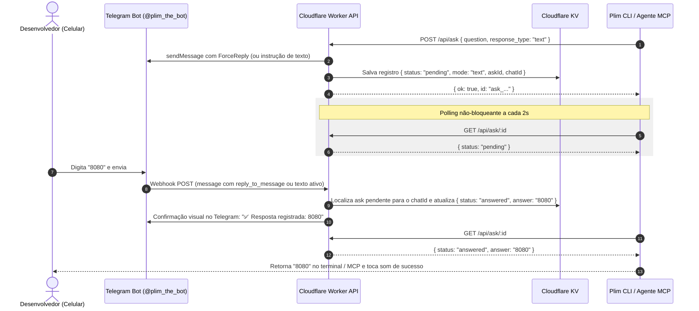

# 01 - Resposta de Texto Livre (`plim ask --input` / `plim input`)

## 💡 Contexto e Motivação

Atualmente, o `plim ask` e a ferramenta MCP `plim_ask` suportam exclusivamente opções pré-definidas em forma de botões inline no Telegram (ex: `["Sim", "Não"]`, `["Opção A", "Opção B"]`).

No entanto, tanto desenvolvedores quanto agentes autônomos de IA frequentemente precisam de dados dinâmicos abertos que não podem ser previstos em botões, por exemplo:
* Solicitar o nome de uma nova branch (`feature/login-google`).
* Solicitar uma chave temporária de API ou token de teste.
* Definir uma mensagem de commit personalizada ou tag semântica.
* Obter esclarecimentos pontuais de regras de negócio ou de design.

---

## 💻 Experiência de Uso (Interface)

### 1. Na Linha de Comando (CLI)

```bash
# Pergunta com resposta em texto livre
BRANCH=$(plim ask --input "Qual o nome da branch para esta feature?")
echo "Criando branch $BRANCH..."

# Sintaxe abreviada
COMMIT_MSG=$(plim input "Digite a mensagem para o commit:")
git commit -m "$COMMIT_MSG"
```

### 2. No Servidor MCP (`bin/plim-mcp.js`)

Extensão da ferramenta `plim_ask` com o parâmetro `response_type`:

```json
{
  "name": "plim_ask",
  "arguments": {
    "question": "Qual porta você deseja expor para o container Docker?",
    "response_type": "text",
    "placeholder": "Ex: 8080",
    "timeout": 300
  }
}
```

**Retorno do MCP:**
```json
{
  "content": [
    {
      "type": "text",
      "text": "Developer responded via Telegram:\n• Text: \"8080\"\n• Question: \"Qual porta você deseja expor para o container Docker?\""
    }
  ]
}
```

---

## 🔄 Fluxo de Execução



---

## ⚙️ Especificação Técnica

### 1. Cloudflare Worker (`worker/src/index.ts`)

* **Identificação de Resposta no Webhook**:
  * Quando o Telegram envia uma mensagem regular (`message.text`) em vez de um clique de botão (`callback_query`):
    1. O Worker verifica se existe uma pergunta pendente com `mode: "text"` associada ao `chatId` no KV (ex: chave `active_input:<chatId> -> <askId>`).
    2. Alternativamente, utiliza o mecanismo nativo `ForceReply` do Telegram, que faz a resposta citar (`reply_to_message`) a mensagem da pergunta original.
* **Endpoints**:
  * `POST /api/ask`: Aceita `response_type: "buttons" | "text"`.
    * Se `buttons`: continua o fluxo atual de Inline Keyboard.
    * Se `text`: cria a chave de estado pendente e dispara a mensagem no Telegram com `ForceReply` ou botão auxiliar opcional `[❌ Cancelar]`.

### 2. CLI (`bin/plim`)

* Nova função `input_cli()` ou extensão de `ask_cli()` tratando o parâmetro `--input` / `input`.
* Suporte a piping e atribuição direta a variáveis no shell (`RES=$(plim input "...")`).

### 3. Casos de Borda e Segurança

* **Timeout**: Caso o desenvolvedor não responda dentro do limite configurado (default: 300s), a pergunta expira no KV e a CLI/MCP retorna código de erro amigável, liberando o processo.
* **Botão de Cancelamento**: Incluir um botão inline `[❌ Cancelar]` mesmo em perguntas de texto para permitir abortar sem precisar digitar `/cancel`.
* **Sanitização**: Sanitizar quebras de linha e caracteres de escape que possam quebrar scripts ao receber a resposta.
