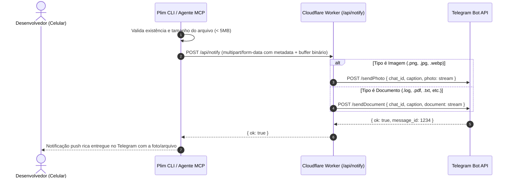

# 02 - Envio de Mídia e Arquivos (`plim --image` / `plim --file`)

## 💡 Contexto e Motivação

Atualmente, o Plim suporta apenas envio de notificações textuais e trechos truncados de logs no Telegram.

Com o aumento de fluxos automatizados e agentes visuais/front-end, desenvolvedores frequentemente precisam visualizar artefatos no celular sem precisar abrir o computador:
* **Testes End-to-End**: Screenshots automáticos de falhas de UI gerados por ferramentas como Playwright, Cypress ou Selenium.
* **Mockups e UI de Agentes**: Imagens geradas por agentes de IA mostrando o layout ou componentes criados.
* **Relatórios e Logs Longos**: Envio de arquivos de cobertura (`coverage.html`), PDFs de homologação ou logs completos (`build.log`) que excederiam o limite de caracteres de uma mensagem do Telegram.

---

## 💻 Experiência de Uso (Interface)

### 1. Na Linha de Comando (CLI)

```bash
# Envio de imagem/screenshot com legenda
plim -n "Falha no teste de checkout" --image ./test-results/checkout-fail.png

# Envio de documento/arquivo
plim -n "Relatório de cobertura gerado" --file ./coverage/lcov-report.pdf

# Encadeado após execução de testes
npm test || plim -n "Testes quebraram!" --image ./screenshots/last-error.png
```

### 2. No Servidor MCP (`bin/plim-mcp.js`)

Extensão da ferramenta `plim_notify`:

```json
{
  "name": "plim_notify",
  "arguments": {
    "title": "Falha no Teste Visual",
    "message": "O botão de pagamento ficou desalinhado na resolução mobile.",
    "status": "error",
    "image_path": "/Users/dev/project/artifacts/visual-diff.png"
  }
}
```

---

## 🔄 Fluxo de Dados e Arquitetura



---

## ⚙️ Especificação Técnica

### 1. Cloudflare Worker (`worker/src/index.ts`)

* Suporte a `multipart/form-data` no endpoint `POST /api/notify` usando os parsers nativos do Hono (`await c.req.parseBody()` ou `FormData`).
* Encaminhamento via `FormData` nativo para a API do Telegram (`https://api.telegram.org/bot<TOKEN>/sendPhoto` ou `/sendDocument`).
* **Proteção de Cotas**:
  * Limite máximo de arquivo: **5 MB** (compatível com os limites de memória e tempo de CPU do Cloudflare Worker Free).
  * Arquivos maiores que 5MB são rejeitados com mensagem clara informando a restrição.

### 2. CLI Unix (`bin/plim`)

* Uso do `curl -F "file=@/caminho/do/arquivo"` nativo, presente em todas as plataformas (macOS, Linux, WSL).
* Verificação prévia de tamanho via `stat` (ou `ls -l` em ambientes legados do macOS).
* Fallback gracioso: Se o upload falhar ou o arquivo exceder o tamanho, envia a mensagem em texto puro avisando que o anexo não pôde ser transmitido.

### 3. Servidor MCP (`bin/plim-mcp.js`)

* Leitura do arquivo usando `fs.readFileSync` ou `fs.createReadStream` com `fetch` e `FormData` nativos do Node 18+ (sem adicionar bibliotecas como `axios` ou `form-data`).
