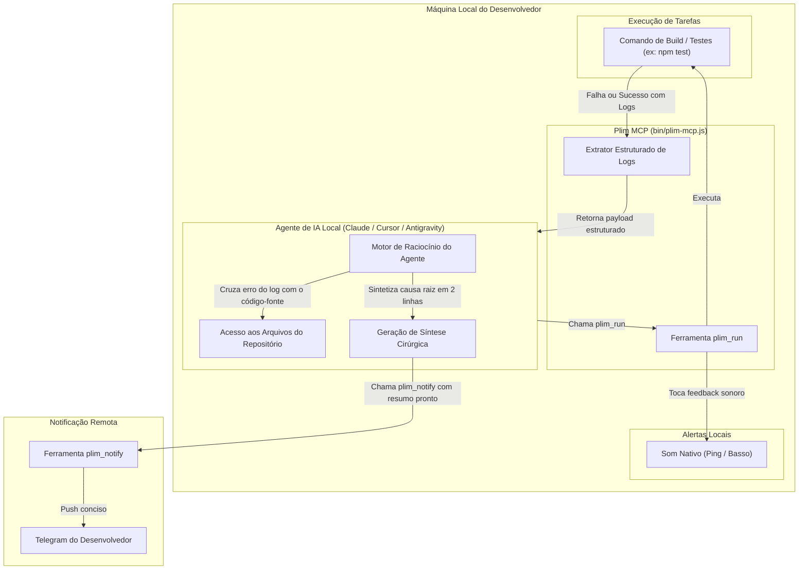

# 05 - Resumo Inteligente de Logs pelo Agente Local (Zero Nuvem / Alta Privacidade)

## 💡 Contexto e Racional

Processar logs de erro usando modelos de IA na nuvem (como APIs externas ou Workers AI) traz desvantagens:
1. **Custos operacionais e limites de cota** da infraestrutura de backend.
2. **Risco de privacidade**: Trechos de código proprietário, variáveis de ambiente ou dados sensíveis em logs seriam transmitidos a servidores terceiros.
3. **Falta de contexto do repositório**: Uma IA genérica na nuvem vê apenas o erro isolado, sem acesso aos arquivos de código, branches ou commits do projeto.

Por outro lado, o desenvolvedor **já possui um Agente de IA rodando localmente** (Claude Code, Cursor, Antigravity, Windsurf, Cline) que possui **acesso completo ao código-fonte, git e terminal**.

Esta funcionalidade delega a análise e síntese de logs diretamente ao **Agente Local** através do protocolo MCP, sem envolver qualquer IA no Cloudflare Worker.

---

## 🏗️ Como Funciona a Arquitetura



---

## ⚙️ Especificação Técnica do Retorno Estruturado (`plim_run`)

Para que o agente local possa fazer um diagnóstico cirúrgico em milissegundos sem estourar sua janela de contexto, o `plim_run` no MCP passará a retornar um objeto estruturado em JSON:

```json
{
  "command": "cargo test --workspace",
  "exitCode": 101,
  "durationSeconds": 48.2,
  "status": "failure",
  "stdoutTail": "...últimas 20 linhas de saída padrão...",
  "stderrTail": "error[E0433]: failed to resolve: use of undeclared crate or module `tokio`",
  "extractedErrors": [
    {
      "file": "src/worker/pool.rs",
      "line": 42,
      "message": "failed to resolve: use of undeclared crate or module `tokio`"
    }
  ],
  "fullLogPath": "/Users/dev/.config/plim/logs/cargo_test_20261002_014022.log"
}
```

### O que o Agente Local faz com esse retorno?

1. **Localização Instantânea**: O agente identifica imediatamente o arquivo e a linha afetados (`src/worker/pool.rs:42`).
2. **Consulta Local**: Ele lê o arquivo localmente, entende que faltou a dependência `tokio` no `Cargo.toml`.
3. **Notificação Sintetizada**: Em vez de disparar um log ilegível no Telegram, o agente chama `plim_notify`:
   > ❌ **Cargo Test falhou (48s)**  
   > **Causa:** Faltou adicionar a dependência `tokio` no `Cargo.toml`.  
   > 💡 *Já corrigi o manifesto e iniciei uma nova compilação.*

---

## 💻 Integração Direta na CLI (`bin/plim`)

Para quem usa o terminal puro sem agente de IA ativo naquele momento:

```bash
# Salva automaticamente o log completo da última execução em arquivo rotativo
plim run npm run build

# Consulta rápida do último erro estruturado
plim last-error

# Exporta contexto formatado para agentes de linha de comando (ex: Aider, Claude CLI)
plim last-error --prompt | claude
```

### Estrutura de Armazenamento Local de Logs

* Local: `~/.config/plim/logs/` (ou `$XDG_STATE_HOME/plim/logs/`).
* Retenção: Mantém apenas os últimos 5 logs de comandos para não consumir espaço em disco.
* Formato: Texto puro com cabeçalho de metadata (comando, timestamp, exit code e tempo decorrido).

---

## 🛡️ Benefícios desta Abordagem

1. **Custo Zero**: Nenhum token é consumido em APIs externas ou servidores do Cloudflare Worker.
2. **Privacidade Total**: O código-fonte e o log completo do terminal permanecem 100% locais na máquina do desenvolvedor.
3. **Precisão Superior**: O agente local consegue ler os arquivos ao redor da falha e fornecer uma análise causal completa, em vez de apenas ler o erro superficial.
