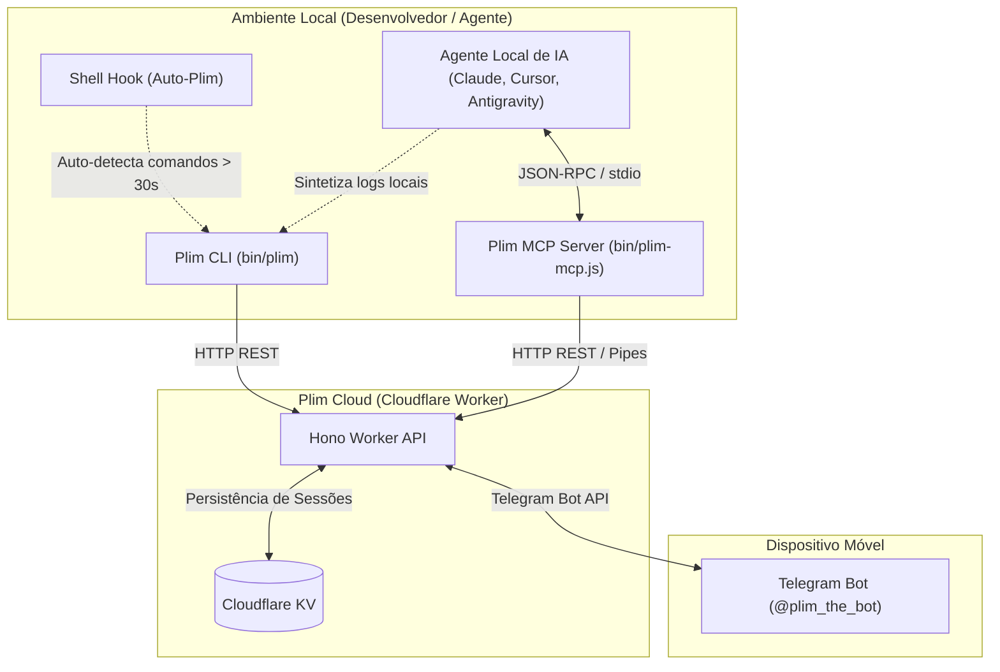

# 📋 Backlog de Funcionalidades do Plim (Roadmap / Todo)

Este diretório contém as especificações técnicas, arquiteturais e de experiência de usuário (UX) para as próximas funcionalidades prioritárias do **Plim**.

As propostas aqui documentadas priorizam a expansão da supervisão remota, a autonomia dos agentes de IA e a produtividade no terminal, mantendo a filosofia do projeto: **leve, instantâneo, resiliente e multiplataforma**.

---

## 🎯 Índice de Especificações

| # | Especificação | Objetivo | Impacto Principal |
|---|---|---|---|
| **01** | [Resposta de Texto Livre](01-resposta-texto-livre.md) | Permitir perguntas abertas com resposta digitada no Telegram | CLI & Agentes de IA (MCP) |
| **02** | [Envio de Mídia e Arquivos](02-envio-de-midia.md) | Suporte a screenshots, logs e anexos no Telegram | Testes E2E, CI e Agentes |
| **03** | [Mensagens de Progresso Dinâmico](03-mensagens-de-progresso.md) | **✅ Concluído (v1.6.0)** - Live Status e comandos encadeados | Redução de ruído e Live Status |
| **04** | [Modo Auto-Plim (Shell Hook)](04-modo-auto-plim.md) | **✅ Concluído (v1.5.0)** - Alerta comandos demorados e encadeados | Terminal diário (Zsh / Bash / Fish) |
| **05** | [Resumo de Logs pelo Agente Local](05-resumo-de-logs-agente-local.md) | Síntese de falhas direto no contexto do agente local (sem IA em nuvem) | Custo zero, privacidade e diagnóstico ágil |

---

## 🏗️ Visão Geral da Arquitetura

---

## 📌 Critérios Gerais de Implementação

Quando essas funcionalidades forem selecionadas para desenvolvimento, deverão seguir rigorosamente as regras do projeto ([AGENTES.md](../../AGENTES.md)):

1. **Zero dependências npm pesadas** no MCP (`bin/plim-mcp.js` puro em Node.js com módulos nativos).
2. **Compatibilidade estrita com Bash 3.2+** no macOS e compatibilidade Windows (`bin/plim.ps1`).
3. **Internacionalização (i18n)**: Suporte obrigatório a Português (`pt`) e Inglês (`en`).
4. **Sincronização de versão e CHANGELOG** nos 5 arquivos canônicos do repositório.
